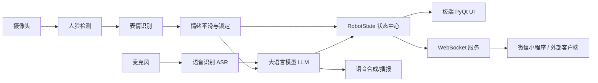

# Emotion Robot 智能情感机器人

> 基于 RISC-V 开发板的智能情感陪伴机器人项目，集成视觉表情识别、语音识别、大语言模型对话、语音播报、板端 UI 展示以及 WebSocket 实时数据同步。

本项目面向“情绪感知 + 语音陪伴 + 小程序/外部端展示”的应用场景。机器人可以通过摄像头识别人脸与表情，通过麦克风采集用户语音并进行 ASR 转写，再结合当前情绪状态调用 LLM 生成更自然的陪伴式回复，最后通过 TTS 进行语音播报。同时，板端会把当前状态、聊天记录、情绪统计和分时段建议通过 WebSocket 推送给外部 App 或微信小程序端。

## 1. 项目特点

* **视觉情绪识别**：基于人脸检测模型与表情分类模型，识别用户当前情绪状态。
* **语音交互闭环**：支持语音采集、语音转文字、LLM 回复生成和语音播报。
* **情绪上下文对话**：LLM 回复会结合当前识别到的情绪，使回答更贴近用户状态。
* **PyQt 板端 UI**：在开发板本地显示机器人状态、聊天过程和人脸画面。
* **WebSocket 实时同步**：向微信小程序或其他客户端实时推送状态、聊天记录、统计图数据和建议数据。

## 2. 系统架构



## 3. 目录结构

```text
Emotion_robot/
├── config/                  # 项目配置文件
├── csrc/                    # C/C++ 外设或底层相关代码
├── lib/                     # 编译或依赖库文件
├── model/                   # 模型文件目录
│   ├── asr/                 # 语音识别模型相关文件
│   └── llm/                 # 大语言模型相关文件
├── scripts/                 # 安装、启动或辅助脚本
├── server/                  # 板端服务模块
│   ├── __init__.py
│   ├── board_ws.py          # WebSocket 服务，负责向客户端推送数据
│   └── robot_state.py       # 机器人统一状态中心、统计和建议生成
├── src/                     # Python 主程序源码
│   ├── asr/                 # 语音采集、ASR、TTS 相关模块
│   ├── llm/                 # LLM 调用与情绪提示词
│   ├── ui/                  # PyQt 图形界面
│   ├── vision/              # 视觉识别模块
│   └── main.py              # 项目主入口
├── wav/                     # 初始化音频、提示音等资源
├── knowledge.txt            # 知识库或提示词相关文本
├── requirements.txt         # venv_Python 依赖
├── requirements1.txt         # venv_tts_Python 依赖
└── README.md
```
## 4. 项目定位

本项目不是单纯的表情识别 Demo，而是一个面向真实用户的智能情感陪伴机器人。它的重点不是“让机器人知道用户是什么表情”，而是让用户能够看到自己的情绪变化，并在不同时间段获得更自然、更人性化的情绪陪伴建议。

## 5. License

当前仓库暂未添加开源许可证。如需公开分发、二次开发或商业使用，建议先补充明确的 License 文件。
